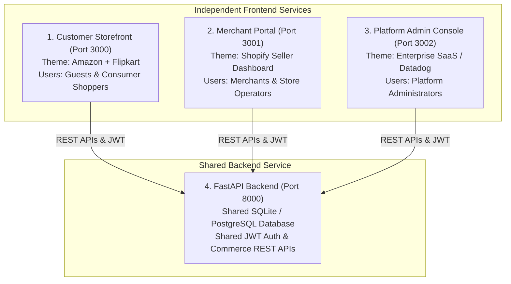

# RazorCommerce AI — Autonomous AI Commerce Operating System

[](https://fastapi.tiangolo.com)
[](https://nextjs.org)
[](https://tailwindcss.com)
[](https://www.typescriptlang.org)
[](https://www.python.org)
[](#-4-service-multi-application-architecture)
[](LICENSE)

> **RazorCommerce AI** is an AI Commerce Operating System built on Razorpay APIs. It enables merchants to become AI-buyable while customers autonomously discover, compare, and purchase products through intelligent shopping agents with transparent GST-inclusive pricing and 1-click Razorpay checkouts.

---

## 🏛️ 4-Service Multi-Application Architecture

The platform is partitioned into **four independently running services**, each tailored for its specific persona and operating on dedicated ports with shared backend APIs and database:



---

## 📱 Independent Service Specifications

| Service | Directory | Port | UI Theme | Target Audience | Key Routes & Pages |
| :--- | :--- | :--- | :--- | :--- | :--- |
| **1. Customer Storefront** | `apps/customer-storefront` | `http://localhost:3000` | Amazon + Flipkart | Consumer Buyers & Guests | Home (`/`), Categories (`/categories`), Product Details (`/products/[id]`), Shopping Cart (`/cart`), Checkout (`/checkout`), Orders (`/orders`), Wishlist (`/wishlist`), AI Assistant (`/assistant`) |
| **2. Merchant Portal** | `apps/merchant-portal` | `http://localhost:3001` | Shopify Seller Dashboard | Store Owners & Ops Teams | Hub (`/`), Catalog (`/catalog`), Inventory (`/inventory`), Orders & 7-Stage Fulfillment (`/orders`), Shipping & Logistics (`/shipping`), Campaigns (`/campaigns`), Revenue (`/revenue`), Copilot (`/copilot`), Settings (`/settings`) |
| **3. Platform Admin Console** | `apps/admin-console` | `http://localhost:3002` | Enterprise SaaS Console | Platform Superadmins | Overview (`/`), Merchant Approvals (`/merchants`), Users & RBAC (`/users`), Payment Core (`/payments`), Fraud Center (`/fraud`), Disputes (`/disputes`), Analytics (`/analytics`), Settings (`/settings`) |
| **4. FastAPI Backend Core** | `backend` | `http://localhost:8000` | OpenAPI / REST | All Frontend Services | Shared DB (`payments.db`, `catalog.db`, `auth.db`), Shared JWT Auth, HMAC Signature Verification, Multi-Courier Tracking APIs |

---

## 🚀 Quickstart & Run Commands

### 1. Start the FastAPI Backend (Port 8000)
```bash
cd backend
python -m uvicorn app.main:app --host 0.0.0.0 --port 8000 --reload
```
*API Swagger Documentation is live at: [http://localhost:8000/docs](http://localhost:8000/docs)*

---

### 2. Start the Frontend Services

You can start any service individually or run them concurrently:

#### 🛒 Option A: Customer Storefront (Port 3000)
```bash
# From workspace root:
npm run dev:customer

# Or from app directory:
cd apps/customer-storefront
npm run dev
```
*Customer Storefront is live at: [http://localhost:3000](http://localhost:3000)*

#### 🏬 Option B: Merchant Portal (Port 3001)
```bash
# From workspace root:
npm run dev:merchant

# Or from app directory:
cd apps/merchant-portal
npm run dev
```
*Merchant Portal is live at: [http://localhost:3001](http://localhost:3001)*

#### 👑 Option C: Platform Admin Console (Port 3002)
```bash
# From workspace root:
npm run dev:admin

# Or from app directory:
cd apps/admin-console
npm run dev
```
*Platform Admin Console is live at: [http://localhost:3002](http://localhost:3002)*

---

## 🔑 Demo Personas & Credentials

| Persona | Email | Password | Dedicated Application Port | Permissions & Capabilities |
| :--- | :--- | :--- | :--- | :--- |
| **Consumer Shopper** | `customer@acme.com` | `demo123` | **Port 3000** (`http://localhost:3000`) | Autonomous AI Search, GST-Inclusive Catalog, Cart, Razorpay Multi-Checkout, Order Tracking |
| **Merchant Seller** | `owner@acme.com` | `demo123` | **Port 3001** (`http://localhost:3001`) | Catalog & Inventory Management, 7-Stage Order Pipeline, Courier Dispatch, Revenue Analytics, AI Copilot |
| **Platform Administrator** | `admin@razorcommerce.ai` | `demo123` | **Port 3002** (`http://localhost:3002`) | Merchant KYC Approvals, Multi-Rail Payment Core, Fraud & Exception Monitoring, Disputes, API Keys |

---

## 📦 Core Feature Modules

### 1. 🛍️ Customer Marketplace Storefront (Port 3000)
* **Above-the-Fold Featured Products**: Instant visual engagement with 4-column responsive grid, rating stars, reviews count, and free delivery indicators.
* **Transparent GST-Inclusive Pricing**: Customer prices are always displayed as `₹X Inclusive of GST` with zero surprise taxes added at checkout.
* **AI Shopping Assistant**: Autonomous conversational buyer copilot for natural-language product discovery, real-time comparison, and recommendations.
* **Razorpay Multi-Method Checkout**:
  * **UPI / QR**: Dynamic QR code generation, UPI ID verification (GPay, PhonePe, Paytm, CRED).
  * **Cards**: Credit and Debit cards with CVV verification and instant OTP flow.
  * **Net Banking**: HDFC, ICICI, SBI, Axis, Kotak, and 50+ Indian banks.
  * **Wallets & Pay Later**: Amazon Pay, Paytm Wallet, Simpl, LazyPay.

### 2. 🏬 Merchant Operations Portal (Port 3001)
* **Catalog & Inventory Center**: 50 pre-seeded enterprise SKUs with stock level adjustments, base price vs customer price calculation, and promotional offers.
* **7-Stage Order Logistics Pipeline**:
  $$\text{PAYMENT\_RECEIVED} \rightarrow \text{ACCEPTED} \rightarrow \text{PICKING} \rightarrow \text{PACKED} \rightarrow \text{READY\_FOR\_PICKUP} \rightarrow \text{IN\_TRANSIT} \rightarrow \text{DELIVERED}$$
* **Simulated Courier Integration**: Delhivery, Blue Dart, Shiprocket, and Ekart with automated AWB generation and 11-stage tracking milestones.
* **Growth & Campaign Orchestration**: AI-generated campaigns, price elasticity modeling, and revenue lift forecasting.
* **Commerce AI Copilot**: ReAct tool-augmented seller assistant for sales forecasting, low-stock warnings, and pricing recommendations.

### 3. 👑 Platform Admin Console (Port 3002)
* **Merchant Governance**: Merchant KYC review, onboardings, settlement bank account verification, and catalog quotas.
* **Multi-Rail Payment Engine**: Live transaction ledger, 3-way reconciliation (Razorpay, Bank Payouts, Ledger), and MDR fee recomputation.
* **Fraud & Exception Center**: Real-time anomaly detection, settlement delay alerts, duplicate payment resolution, and audit logs.
* **Disputes & Chargebacks**: Automated evidence submission, mediation workflows, and instant source refund triggers.
* **Developer Platform**: REST API Key generation, HMAC webhook secret management, and protocol health monitoring with 99.99% SLA metrics.

---

## 📡 REST API Reference

| Endpoint | Method | Tag | Description |
| :--- | :--- | :--- | :--- |
| `/api/v1/catalog/products` | `GET` | Catalog | Filtered, searched & paginated 50-SKU catalog |
| `/api/v1/catalog/products` | `POST` | Catalog | Add new SKU with specs, base price & GST rate |
| `/api/v1/catalog/products/{id}/stock` | `PATCH` | Catalog | Real-time inventory unit adjustment |
| `/api/v1/commerce/checkout` | `POST` | Commerce | Create order, deduct inventory & generate Razorpay session |
| `/api/v1/commerce/verify-payment` | `POST` | Commerce | Verify HMAC signature, capture payment & persist order |
| `/api/v1/merchant/orders` | `GET` | Merchant | List store orders with fulfillment status |
| `/api/v1/merchant/orders/{id}/status` | `PUT` | Merchant | Transition order stage (Picking, Packed, Ready) |
| `/api/v1/merchant/shipping/assign` | `POST` | Logistics | Assign courier (Delhivery/BlueDart) & generate AWB |
| `/api/v1/merchant/shipping/track/{awb}` | `GET` | Logistics | 11-stage shipment tracking timeline |
| `/api/v1/growth/campaigns` | `GET` | Growth | List active automated growth campaigns |
| `/api/v1/growth/simulate` | `POST` | Growth | Price elasticity & volume expansion simulation |
| `/api/v1/auth/login` | `POST` | Auth | Authenticate user & issue JWT bearer token |
| `/api/v1/auth/quick-switch` | `POST` | Auth | 1-Click persona switcher for demo workflows |
| `/api/v1/admin/merchants` | `GET` | Admin | Directory of registered merchant stores & KYC status |
| `/api/v1/reconciliation` | `GET` | Payments | 3-way reconciliation audit ledger |
| `/api/v1/exceptions` | `GET` | Risk | Actionable payment and fulfillment exception queue |

---

## 📄 License
This project is licensed under the MIT License.
