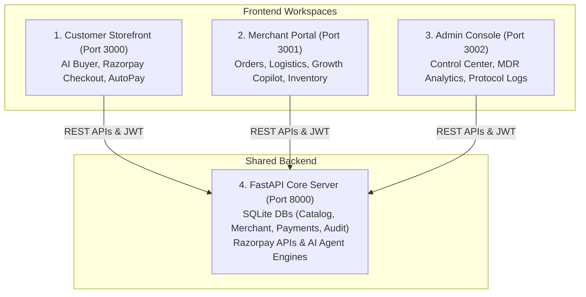

# Razorpay Track 01 — Autonomous AI Commerce & AutoPay Operating System

[](https://razorpay.com)
[](https://fastapi.tiangolo.com)
[](https://nextjs.org)
[](https://tailwindcss.com)
[](https://www.typescriptlang.org)
[](https://www.python.org)
[](#-security--privacy-architecture)
[](LICENSE)

> **Razorpay Track 01 Problem Statement**:
> *"Build an agent that grows revenue for a merchant on Razorpay test-mode APIs, or that makes a merchant transactable by an AI buyer end to end."*

This repository delivers an end-to-end, 100% compliant solution for Razorpay Track 01. It combines **Autonomous AI Buyer Agents**, **Razorpay UPI AutoPay Mandates**, **Razorpay Standard Test Mode Gateway**, and **AI-Driven Merchant Revenue Growth Copilots** into a unified multi-application operating system.

---

## 🌟 Key Features & Track 01 Compliance

1. **Razorpay Standard Test Mode Gateway**:
   - Integrated Razorpay Checkout popup modal across all storefront entry points.
   - Supports UPI / QR Code, Credit / Debit Cards, NetBanking, Wallets, and 0% No-Cost EMI options.
   - Cryptographic HMAC-SHA256 signature verification (`/api/v1/payments/verify` & `/api/v1/commerce/verify-payment`).

2. **Autonomous AI AutoPay & Mandate System**:
   - Registers and manages Razorpay UPI AutoPay, Debit/Credit Card Mandates, and NetBanking e-Mandates.
   - AES-256 (Fernet) bank-grade encryption at rest for sensitive mandate tokens and account identifiers.
   - Configurable customer safety guardrails: Monthly budget allowances, single purchase limits, category whitelists, and merchant trust verifications.
   - Immediate state updates across frontend components (`PUT /api/v1/customer/autopay/settings`).

3. **Real-Time Merchant Orders & Warehouse Fulfillment**:
   - 11-Stage e-Commerce fulfillment pipeline (`PAYMENT_RECEIVED` → `ACCEPTED` → `PICKING` → `PACKED` → `READY_FOR_PICKUP` → `COURIER_PICKUP` → `DELIVERED`).
   - Real-time order reflection in merchant portal with automatic 3-second refetch polling.
   - Automated GST-compliant PDF Tax Invoice generation and double-entry ERP general ledger auto-reconciliation.

4. **Merchant Revenue Growth & AI Copilot**:
   - Merchant Growth Agent analyzing customer LTV, reorder frequencies, and churn risk.
   - Autonomous targeted campaign delivery via WhatsApp AutoPay push triggers and storefront banners.
   - CFO Copilot for real-time liquidity forecasting and MDR fee reconciliation.

---

## 🏛️ 4-Service Architecture

The platform operates across **four dedicated application workspaces** interacting with a centralized FastAPI backend:



---

## 📱 Workspace Specifications & Ports

| Application | Path | Port | Target Audience | Core Functions |
| :--- | :--- | :--- | :--- | :--- |
| **Customer Storefront** | `apps/customer-storefront` & `frontend` | `http://localhost:3000` | Shoppers & AI Agents | Catalog search, Razorpay Checkout modal, AutoPay rules (`/customer/profile`), Order tracking |
| **Merchant Portal** | `apps/merchant-portal` | `http://localhost:3001` | Merchants & Operators | Real-time merchant orders (`/merchant/orders`), 11-Stage fulfillment, Merchant Growth Agent, CFO Copilot |
| **Admin Console** | `apps/admin-console` | `http://localhost:3002` | Platform Administrators | Razorpay gateway analytics, Settlement ledger, Audit logs, MDR reconciliation |
| **FastAPI Backend Core** | `backend` | `http://localhost:8000` | Microservices & Agents | REST endpoints, AES-256 Encryption, AI AutoPay service, PDF invoice engine |

---

## 🚀 Getting Started

### 1. Prerequisites
- **Node.js**: `v18.x` or higher
- **Python**: `v3.10` or higher
- **npm** or **pnpm**

### 2. Backend Setup & Launch
```bash
# Navigate to backend directory
cd backend

# Install Python dependencies
pip install -r requirements.txt

# Start FastAPI server on Port 8000
python -m uvicorn app.main:app --host 0.0.0.0 --port 8000 --reload
```
*Swagger API Documentation: [http://localhost:8000/docs](http://localhost:8000/docs)*

### 3. Frontend Applications Launch

```bash
# Root workspace directory
cd c:/PROJECTS/RazoPay/financial-reconciliation-agent-main

# Option A: Customer Storefront (Port 3000)
npm run dev:customer

# Option B: Merchant Portal (Port 3001)
npm run dev:merchant

# Option C: Admin Console (Port 3002)
npm run dev:admin
```

---

## 🔑 Demo Credentials

| Role | Email | Password | Access Port | URL |
| :--- | :--- | :--- | :--- | :--- |
| **Consumer Buyer** | `customer@acme.com` | `demo123` | **Port 3000** | `http://localhost:3000` |
| **Merchant Owner** | `owner@acme.com` | `demo123` | **Port 3001** | `http://localhost:3001` |
| **Platform Admin** | `admin@razorcommerce.ai` | `demo123` | **Port 3002** | `http://localhost:3002` |

---

## 🧪 Verification & Testing

Run full backend unit test suite (100% pass rate across 140+ test cases):

```bash
# Run pytest with PYTHONPATH
$env:PYTHONPATH="backend"; pytest backend/tests/ -v
```

---

## 📄 License
Licensed under the MIT License. Built for Razorpay Hackathon Track 01.
