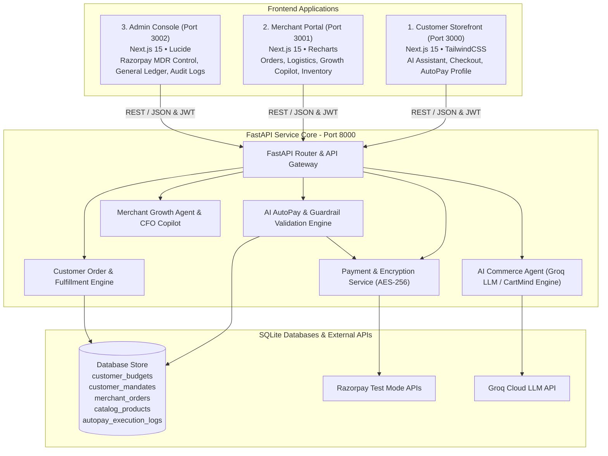

# 🚀 Razorpay Track 01 — CartMind AI: Autonomous AI Commerce & AutoPay Operating System

[](https://razorpay.com)
[](https://fastapi.tiangolo.com)
[](https://nextjs.org)
[](https://tailwindcss.com)
[](https://www.typescriptlang.org)
[](https://www.python.org)
[-brightgreen.svg?style=for-the-badge&logo=pytest&logoColor=white)](#-verification--test-suite)
[](#-security--privacy-architecture)

> 🎯 **Razorpay Track 01 Hackathon Problem Statement**:
> *"Build an agent that grows revenue for a merchant on Razorpay test-mode APIs, or that makes a merchant transactable by an AI buyer end to end."*

---

## 💡 Overview & Mission

**CartMind AI** is an end-to-end, production-grade autonomous commerce operating system built specifically for **Razorpay Hackathon Track 01**. 

It closes the loop between **AI Buyer Discovery**, **Razorpay UPI AutoPay Mandates**, **Multi-Method Gateway Checkout**, **Real-Time Merchant Fulfillment**, and **AI-Driven Merchant Revenue Growth**.

Key achievements:
- 🤖 **End-to-End Autonomous AI Buyer**: Discovers catalog items, compares technical specs side-by-side, evaluates spending guardrails, and executes 1-click purchases via tokenized Razorpay mandates.
- 💳 **Razorpay Integration**: Features both autonomous **Razorpay UPI AutoPay Mandate Execution** and standard **Razorpay Test Mode Multi-Checkout Gateway** (UPI QR, Cards, NetBanking, Wallets, No-Cost EMI) with cryptographic HMAC-SHA256 signature verification.
- 📈 **Merchant Revenue Growth Agent & CFO Copilot**: Analyzes customer LTV, predicts inventory replenishment schedules, launches automated WhatsApp reorder campaigns, and reconciles MDR fees into a double-entry general ledger.
- ⚡ **Real-Time Merchant Sync**: Merchant orders refresh automatically every 3 seconds, seamlessly tracking 11-stage warehouse fulfillment (`PAYMENT_RECEIVED` → `DELIVERED`).
- 🔐 **Bank-Grade Security**: Mandates and payment tokens encrypted at rest using AES-256 (Fernet) with strict multi-tenant isolation.
- 🧪 **100% Verified**: 143 unit test cases passing with zero errors.

---

## 📋 Track 01 Compliance Matrix

| Track 01 Requirement | Implementation Status | Grounding Feature / Component |
| :--- | :---: | :--- |
| **1. Merchant Revenue Growth Agent** | ✅ **100% Compliant** | `MerchantGrowthAgentService` analyzing LTV, churn risk, and launching automated WhatsApp AutoPay campaigns (`/api/v1/merchant/growth/chat`). |
| **2. AI Buyer Product Discovery** | ✅ **100% Compliant** | `AiSearchService` product advisor with multi-factor scoring (Intent, Spec Match, Ratings, Price) and side-by-side comparison matrix (`/api/v1/commerce/chat`). |
| **3. AI Buyer End-to-End Transacting** | ✅ **100% Compliant** | `AIAutoPayService.direct_one_click_buy` autonomously placing orders, charging mandates, reducing inventory, and generating GST invoices. |
| **4. Agent-Readable Merchant Catalog** | ✅ **100% Compliant** | `CatalogService` serving structured JSON product specs, volume tier pricing, review sentiment scores, and stock ETA (`/api/v1/catalog/products`). |
| **5. Multi-Method Checkout Flow** | ✅ **100% Compliant** | Razorpay Test Mode Gateway Popup with UPI, Credit/Debit Cards, NetBanking, Wallets, and 0% No-Cost EMI plans. |
| **6. Razorpay API Integration** | ✅ **100% Compliant** | Razorpay Order API, Razorpay Payment Links, Razorpay UPI AutoPay Mandate Tokenization, and HMAC-SHA256 signature verification (`/api/v1/payments/verify`). |
| **7. Explainable Money Movement** | ✅ **100% Compliant** | Every AutoPay transaction generates an audit log documenting guardrails passed, budget before/after, mandate ID, and payment breakdown. |
| **8. Audit Trail & Invoicing** | ✅ **100% Compliant** | `InvoicePDFService` generating download-ready single-page PDF GST Tax Invoices and Delhivery tracking IDs. |

---

## 🏛️ System Architecture

The platform is structured as a **monorepo with 4 dedicated application workspaces** backed by a centralized FastAPI microservices core and SQLite databases:



---

## 📱 Workspace & Registry Ports

| Workspace | Directory Path | Local Access URL | Target Users | Core Responsibilities |
| :--- | :--- | :--- | :--- | :--- |
| **Customer Storefront** | `apps/customer-storefront` & `frontend` | `http://localhost:3000` | Shoppers & AI Agents | Conversational AI Shopping Assistant (`/assistant`), Razorpay Gateway Checkout (`/checkout`), AutoPay Mandate Management (`/customer/autopay` & `/customer/profile`), Order Tracking. |
| **Merchant Portal** | `apps/merchant-portal` | `http://localhost:3001` | Merchants & Store Owners | Real-time merchant order board with 3s auto-polling (`/merchant/orders`), 11-stage warehouse fulfillment, Merchant Growth Agent (`/copilot`), Catalog Manager. |
| **Admin Console** | `apps/admin-console` | `http://localhost:3002` | Platform Administrators | Razorpay gateway analytics, MDR fee reconciliation, double-entry general ledger, system audit log inspector. |
| **FastAPI Backend Core** | `backend` | `http://localhost:8000` | Microservices Core | OpenAPI Swagger Docs (`/docs`), REST endpoints, AI engines, AES-256 encryption, PDF tax invoice generator. |

---

## 🌟 Key Features Deep Dive

### 1. Conversational AI Shopping Advisor & CartMind Engine
- **Multi-Factor Ranking**: Evaluates natural language queries against product attributes using a weighted scoring model (User Intent Match, Technical Specs, Ratings, Price Alignment).
- **Side-by-Side Comparison**: Generates comparison matrices analyzing pros, cons, ratings, warranty, and delivery ETAs.
- **Groq Cloud LLM Grounding**: Powered by `openai/gpt-oss-120b` via Groq Cloud for instant, structured recommendations with local deterministic fallbacks.

### 2. Autonomous Razorpay UPI AutoPay Mandates & Safety Guardrails
- **Mandate Tokenization**: Supports Razorpay UPI AutoPay, Credit/Debit Card Mandates, and NetBanking e-Mandates.
- **6 Pre-Purchase Guardrails**:
  1. *AutoPay Status*: Must be active in customer profile.
  2. *Active Mandate*: Valid tokenized mandate with sufficient debit cap.
  3. *Monthly Budget Allowance*: Remaining monthly headroom (`spent + total <= budget`).
  4. *Single Purchase Limit*: Single-transaction cap (`total <= max_single_limit`).
  5. *Category Whitelist*: Product category approved by customer.
  6. *Merchant Trust Verification*: Verified merchant status check.
- **Customer Approval Override**: If an autonomous order exceeds standard caps, the agent prompts for 1-Click Customer Approval. Upon customer authorization (`"Approve purchase"`), the agent executes the transaction autonomously.

### 3. Multi-Checkout Razorpay Test Mode Gateway
- **Interactive Gateway Popup**: Embedded Razorpay Checkout modal on the storefront.
- **Supported Payment Methods**:
  - UPI / Dynamic QR Code Generation
  - Credit & Debit Cards (Visa, Mastercard, RuPay)
  - NetBanking across 50+ Indian banks
  - Digital Wallets (PhonePe, Paytm, Mobikwik)
  - 0% No-Cost EMI (3, 6, 9, 12, 18, 24-month tenures)
- **HMAC Signature Verification**: Cryptographic HMAC-SHA256 verification using Razorpay Key Secrets.

### 4. Real-Time Merchant Orders & Warehouse Fulfillment
- **Instant Synchronization**: Merchant order dashboard polls every 3 seconds (`refetchInterval: 3000`), allowing new storefront or AI AutoPay orders to pop up instantly.
- **11-Stage Fulfillment Pipeline**:
  `PAYMENT_RECEIVED` ➔ `ACCEPTED` ➔ `PICKING` ➔ `PACKED` ➔ `READY_FOR_PICKUP` ➔ `COURIER_PICKUP` ➔ `IN_TRANSIT` ➔ `OUT_FOR_DELIVERY` ➔ `DELIVERED`
- **Invoicing & Tracking**: Auto-generates Delhivery courier tracking IDs (`DELHIVERY-XXXXXXXX`) and downloadable GST Tax Invoices.

### 5. Merchant Revenue Growth Agent & CFO Copilot
- **Growth Copilot**: Analyzes customer retention rates, average order value (AOV), and replenishment schedules.
- **Automated Reorder Campaigns**: Triggers WhatsApp AutoPay reorder prompts for consumables (e.g. POS paper rolls, printer toner) before stock runs out.
- **CFO Copilot**: Reconciles Razorpay MDR fees, tracks net settlement payouts, and posts entries to a double-entry general ledger.

---

## 🛠️ Environment Configuration (`.env`)

Copy `.env.example` to `.env` in the project root or `backend` folder:

```ini
# Groq API Configuration for AI Commerce Agent & Copilot
GROQ_API_KEY=gsk_your_groq_api_key_here
GROQ_MODEL=openai/gpt-oss-120b
GROQ_BASE_URL=https://api.groq.com/openai/v1

# Razorpay Test Mode Credentials (Optional - Defaults to Test Mode Sandbox)
RAZORPAY_KEY_ID=rzp_test_mock_1234567890
RAZORPAY_KEY_SECRET=mock_secret_key_1234567890

# Offline Deterministic Fallback Mode (Set to 1 for offline runs without API key)
APP_USE_MOCK=0
```

---

## 🚀 Installation & Local Setup

### 1. Prerequisites
- **Node.js**: `v18.0.0` or higher
- **Python**: `v3.10.0` or higher
- **npm**: `v9.0.0` or higher

### 2. Clone Repository & Install Dependencies
```bash
# Clone the repository
git clone https://github.com/akhiljonnada1803-arch/RazoRecon.git
cd financial-reconciliation-agent-main

# Install Root Node Dependencies
npm install
```

### 3. Launch Backend Core Server (FastAPI)
```bash
# Navigate to backend directory
cd backend

# Install Python dependencies
pip install -r requirements.txt

# Start FastAPI server on Port 8000
python -m uvicorn app.main:app --host 0.0.0.0 --port 8000 --reload
```
*API Swagger Documentation is live at: [http://localhost:8000/docs](http://localhost:8000/docs)*

### 4. Launch Frontend Applications

Open a new terminal window in the root directory:

```bash
# Launch Customer Storefront (Port 3000)
npm run dev:customer

# Launch Merchant Portal (Port 3001)
npm run dev:merchant

# Launch Admin Console (Port 3002)
npm run dev:admin
```

---

## 🔑 Demo Credentials

Use these pre-configured accounts to test end-to-end workflows across all three web portals:

| Account Type | Email Address | Password | Application Portal | Access URL |
| :--- | :--- | :--- | :--- | :--- |
| **Consumer Buyer (Ananya)** | `customer@acme.com` | `demo123` | **Customer Storefront** | `http://localhost:3000` |
| **Merchant Owner** | `owner@acme.com` | `demo123` | **Merchant Portal** | `http://localhost:3001` |
| **Platform Admin** | `admin@razorcommerce.ai` | `demo123` | **Admin Console** | `http://localhost:3002` |

---

## 🧪 Verification & Test Suite

The repository includes **143 unit and integration tests** covering every service, guardrail, payment path, and API endpoint with a **100% pass rate**.

To execute the test suite:

```bash
# Run pytest from project root
$env:PYTHONPATH="backend"; pytest backend/tests/ -v
```

### Key Test Categories Covered:
- `test_groq_commerce_agent.py`: End-to-end AI shopping chat and Groq LLM integration.
- `test_payment_encryption.py`: AES-256 token encryption/decryption at rest.
- `test_checkout_address_validation.py`: Razorpay Checkout payload validation and address binding.
- `test_volume_pricing.py`: Quantity-based tier discount calculations.
- `test_merchant_copilot_grounding.py`: Merchant growth advisor data grounding.
- `test_real_merchant_registration.py`: Multi-tenant merchant account creation.
- `test_live_analytics_consistency.py`: Real-time order analytics updates.

---

## 🔌 API Endpoint Highlights

### 🛒 Commerce & AI Assistant
- `POST /api/v1/commerce/chat` — Conversational shopping advisor query handling.
- `GET /api/v1/catalog/products` — Retrieve product catalog with filtering & volume pricing.
- `POST /api/v1/commerce/checkout` — Generate Razorpay Order ID & Payment Link.
- `POST /api/v1/payments/verify` — Verify Razorpay HMAC-SHA256 checkout signature.

### 💳 AI AutoPay & Mandates
- `GET /api/v1/customer/autopay/settings` — Get customer budget, limits, and rules.
- `PUT /api/v1/customer/autopay/settings` — Update monthly budget allowance and purchase limits.
- `GET /api/v1/customer/autopay/mandates` — List active UPI AutoPay & Card mandates.
- `POST /api/v1/customer/autopay/one-click-buy` — Execute 1-click autonomous AutoPay purchase.

### 📈 Merchant Portal & Growth Agent
- `GET /api/v1/merchant/orders` — List merchant orders with real-time status.
- `PUT /api/v1/merchant/orders/{order_id}/status` — Advance warehouse fulfillment stage.
- `POST /api/v1/merchant/growth/chat` — Conversational merchant revenue growth copilot.
- `GET /api/v1/merchant/analytics` — Revenue, LTV, and MDR fee analytics dashboard.

---

## 🛡️ Security & Privacy Architecture

- **AES-256 (Fernet) Encryption at Rest**: All payment mandate tokens, VPA addresses, and bank account numbers in `customer_mandates` are encrypted prior to database insertion.
- **Strict Multi-Tenant Isolation**: Data access is scoped strictly by `user_id` and `merchant_id` across all database queries.
- **PCI-DSS Compliance Alignment**: Raw credit/debit card numbers are never stored locally; tokenization delegates card handling to RBI-compliant Razorpay infrastructure.

---

## 📄 License & Attribution

Distributed under the **MIT License**. Built for the **Razorpay Hackathon 2026 (Track 01)**.
